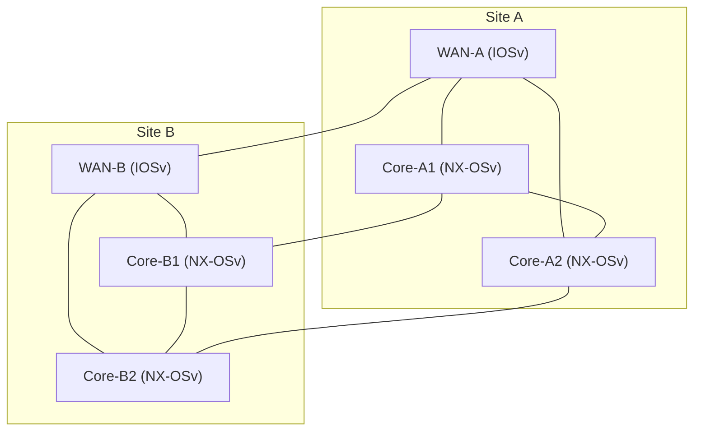

# Lab Topology

```mermaid
graph TD
    subgraph SiteA["Site A"]
        WANA["WAN-A (IOSv)"]
        CA1["Core-A1 (NX-OSv)"]
        CA2["Core-A2 (NX-OSv)"]
    end
    subgraph SiteB["Site B"]
        WANB["WAN-B (IOSv)"]
        CB1["Core-B1 (NX-OSv)"]
        CB2["Core-B2 (NX-OSv)"]
    end

    WANA --- WANB
    WANA --- CA1
    WANA --- CA2
    WANB --- CB1
    WANB --- CB2
    CA1 --- CA2
    CB1 --- CB2
    CA1 --- CB1
    CA2 --- CB2
```

